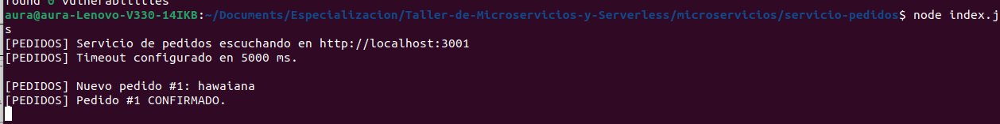
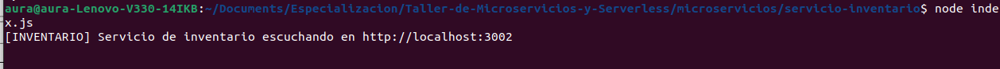
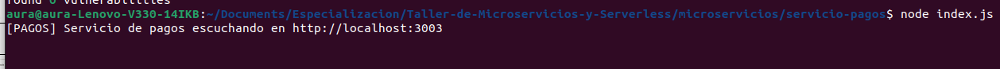
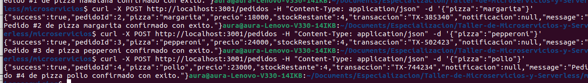
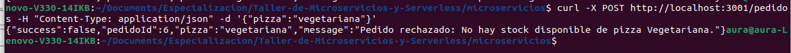
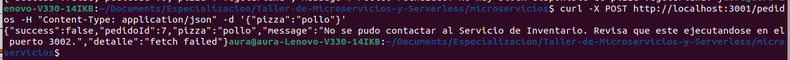
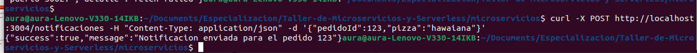
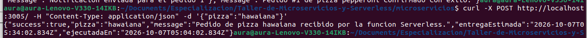
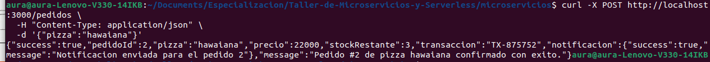

# Respuestas del taller

Nombre del estudiante: Aura Milena Alba Suarez

---

## Preguntas de análisis — Microservicios

### 1. ¿Qué responsabilidad tiene cada microservicio?

- **`servicio-pedidos` (Puerto 3001):** Coordina y orquesta todo el flujo del pedido; recibe la solicitud del cliente, consulta disponibilidad en el inventario, procesa el pago y gestiona el envío de notificaciones.
- **`servicio-inventario` (Puerto 3002):** Administra el stock y la lista de precios de las pizzas (`pizzas.json`), permitiendo consultar disponibilidad y descontar existencias tras cada compra.
- **`servicio-pagos` (Puerto 3003):** Simula la pasarela de pagos, procesando las transacciones de cobro y devolviendo un identificador único de confirmación.
- **`servicio-notificaciones` (Puerto 3004):** Se encarga de enviar y registrar los mensajes de confirmación al cliente una vez el pedido ha sido procesado con éxito.
- **`gateway` (Puerto 3000):** Funciona como punto único de entrada (Single Point of Entry), enrutando las peticiones de los clientes hacia cada uno de los microservicios correspondientes y registrando los logs de acceso.

### 2. ¿Cómo se comunican?

Se comunican a través del protocolo **HTTP** utilizando arquitectura **REST** y formato de intercambio de datos **JSON**. Los servicios exponen *endpoints* (rutas) utilizando métodos como `GET` y `POST`. Para llamadas entre servicios (como `pedidos` consultando a `inventario` o `pagos`), se emplean peticiones `fetch` asíncronas de servidor a servidor.

### 3. ¿Qué ocurre cuando un servicio deja de funcionar?

Si un microservicio dependiente (como `inventario` o `pagos`) se detiene, el servicio principal (`pedidos`) no colapsa ni interrumpe la ejecución del proceso Node.js. En su lugar, el error es capturado por un bloque `try/catch`, devolviendo una respuesta controlada al cliente (como un código HTTP `503 Service Unavailable` o un mensaje con estado de fallo). Esto demuestra el aislamiento de fallos en arquitecturas de microservicios.

### 4. ¿Qué ventajas observaste al separar el sistema?

- **Despliegue e independencia:** Cada microservicio puede desarrollarse, modificarse, reiniciarse y desplegarse sin afectar a los demás.
- **Tolerancia a fallos:** El fallo de un componente no tumba toda la aplicación (por ejemplo, al fallar `notificaciones`, el pedido principal se pudo confirmar igualmente).
- **Escalabilidad selectiva:** Se pueden asignar más recursos únicamente al servicio con mayor carga (como `pedidos` o `inventario`) sin necesidad de escalar todo el backend.
- **Mantenibilidad:** El código de cada módulo es corto, enfocado y fácil de entender.

### 5. ¿Qué problemas puede generar tener varios servicios?

- **Complejidad de red y latencia:** Las llamadas HTTP encadenadas entre servicios introducen latencia acumulada y riesgo de fallos de red o tiempos de espera (*timeouts*).
- **Gestión de fallos en cascada:** Un fallo o enlentecimiento en un servicio de la cadena puede bloquear los recursos de los servicios que dependen de él.
- **Consistencia de datos:** Es más difícil mantener la consistencia transaccional (ACID) entre múltiples bases de datos o servicios independientes.
- **Complejidad operativa:** Requiere mantener múltiples procesos en ejecución, gestionar puertos, monitoreo y configuración de red.

### 6. ¿Qué aprendiste al crear servicio-notificaciones?

Aprendí a integrar un nuevo microservicio desacoplado dentro de un ecosistema existente. Al configurar `servicio-notificaciones`, comprendí la importancia de manejar las dependencias de forma opcional o no bloqueante: si el servicio responde, se notifica; pero si no está disponible, el flujo transaccional principal (crear el pedido y cobrar) no debe revertirse ni fallar.

---

## Preguntas de análisis — Serverless

### 7. ¿Qué es Serverless?

Serverless (o FaaS - *Function as a Service*) es un modelo de ejecución en la nube donde el desarrollador escribe únicamente el código de la función lógica y el proveedor cloud gestiona automáticamente toda la infraestructura, la provisión de servidores, el escalado y el mantenimiento. Los recursos solo consumen procesamiento cuando la función es invocada.

### 8. ¿Qué diferencia observaste frente a los servicios locales?

Los microservicios locales requieren mantener un proceso HTTP de Express escuchando permanentemente en un puerto específico (`node index.js`). La función Serverless, por el contrario, expone un manejador (*handler*) tipo `(req, res)` que se ejecuta únicamente en respuesta a un evento o petición entrante, destruyéndose o quedando inactiva cuando finaliza la respuesta.

### 9. ¿Qué significa ejecutar una función bajo demanda?

Significa que la función permanece en estado latente (sin consumir cómputo ni generar costos) hasta que entra una solicitud HTTP. En ese instante, la plataforma levanta el entorno de ejecución, procesa la petición y finaliza, facturando únicamente por los milisegundos que tomó completar la tarea.

### 10. ¿Qué ventajas y limitaciones observaste?

- **Ventajas:** Cero administración de servidores, escalabilidad automática de 0 a miles de peticiones en paralelo, y cobro exacto por tiempo de uso.
- **Limitaciones:** Presencia de *Cold Starts* (arranque en frío, donde la primera llamada tarda más mientras se inicializa el contenedor) y falta de estado persistente en memoria entre ejecuciones (*stateless*).

---

## Preguntas finales

### 11. ¿Qué diferencia principal encontraste entre Microservicios y Serverless?

La diferencia principal radica en el **modelo de infraestructura y ciclo de vida de la ejecución**. Los microservicios son servidores con procesos persistentes en memoria que están continuamente encendidos escuchando peticiones. Serverless se basa en funciones efímeras que se activan bajo demanda únicamente durante el tiempo de procesamiento de la solicitud.

### 12. ¿En qué situación utilizarías una arquitectura de Microservicios?

Utilizaría microservicios en sistemas complejos con alto tráfico continuo, necesidades de comunicación interna constante o de baja latencia entre módulos, lógica de negocio interconectada extensa, o donde se requieran conexiones persitentes (como WebSockets o tareas en segundo plano en tiempo real).

### 13. ¿En qué situación utilizarías una función Serverless?

Utilizaría Serverless para tareas orientadas a eventos con cargas de trabajo variables o esporádicas, como procesamiento de imágenes/archivos subidos, envío de correos, procesamiento de webhooks de pago, APIs con picos de tráfico impredecibles o proyectos en etapas iniciales (MVP) donde se busque minimizar costos operativos de infraestructura.

### 14. ¿Qué fue lo más importante que aprendiste durante el taller?

Lo más importante fue entender cómo desacoplar un sistema monolítico en módulos especializados mediante el uso de un **API Gateway** como fachada, y cómo manejar la resiliencia en la comunicación distribuida (captura de errores de red, tiempos de timeout y comunicación tolerante a fallos entre servicios).

---

## Comparación Microservicios vs Serverless

| Característica | Microservicios | Serverless |
|---|---|---|
| Unidad principal | Servicio / Aplicación (Express App) | Función (*Handler*) |
| Ejemplo del taller | `servicio-pedidos` (Puerto 3001) | `funcion-pedido` (Serverless Function) |
| ¿Quién ejecuta el servicio? | Proceso Node.js continuo en servidor/contenedor | Proveedor Cloud / Entorno de ejecución FaaS bajo demanda |
| ¿Cuándo se ejecuta? | Siempre activo (escuchando eventos/puerto) | Solo cuando entra una petición |
| Comunicación | HTTP / REST a través de puertos dedicados | Invocación por eventos / HTTP Endpoint |
| Infraestructura | Servidores dedicados, VM o contenedores Docker | Gestionada al 100% por el proveedor cloud |
| ¿Qué pudo observar el estudiante? | Proceso permanente en terminal, respuesta rápida pero requiere mantener el proceso arriba | Tiempos de respuesta inicial mayores (*cold start*) y ejecución efímera |
---

## Preguntas de análisis — API Gateway

### 15. ¿Qué ventaja tiene que el cliente no sepa que hay varios servicios distintos detrás del gateway?

- **Abstracción y simplicidad:** El cliente solo necesita interactuar con un único dominio/puerto (`http://localhost:3000`), evitando gestionar M puertos o IPs distintas.
- **Seguridad:** Oculta la topología de red y los puertos internos del backend, reduciendo la superficie de ataque.
- **Centralización de políticas:** Permite aplicar autenticación, CORS, límite de peticiones (*rate-limiting*) y logging en un solo punto para toda la arquitectura.
- **Flexibilidad de refactorización:** Permite mover, renombrar o dividir servicios internamente sin romper las URLs de consumo del cliente.

---

## Observaciones de las pruebas

Anota lo que observaste en cada actividad e incluye las capturas de pantalla correspondientes.

- **Actividad 1 (Ejecutar los servicios):** Se iniciaron los tres microservicios base en sus respectivos puertos.
  
  
  
  

- **Actividad 2 (pedidos):** Al enviar la petición POST a `/pedidos`, el servicio devolvió una respuesta JSON exitosa con el `pedidoId` incremental, el precio correspondiente, la reducción del `stockRestante` a 4 y un código de transacción único (`TX-XXXXXX`).
  
  

- **Actividad 3 (sin stock):** Al establecer el `stock` en `0` para la pizza `vegetariana` en `pizzas.json`, el servicio de inventario retornó un error HTTP `409 Conflict`, evitando la creación del pedido.
  
  

- **Actividad 4 (servicio detenido):** Al apagar `servicio-inventario` con `Ctrl + C`, `servicio-pedidos` capturó el fallo de conexión HTTP de forma controlada y respondió con un código HTTP `503 Service Unavailable`, manteniendo el servidor de pedidos en funcionamiento.
  
  

- **Actividad 5 (timeout):** Al reducir `TIMEOUT_MS` a `1` ms, la petición fue abortada antes de que el microservicio de inventario pudiera responder, retornando un error de tiempo de espera agotado.

- **Cuarto microservicio:** Al activar `NOTIFICACIONES_ACTIVAS = true` y ejecutar `servicio-notificaciones` en el puerto `3004`, el pedido incluyó el mensaje de confirmación. Al apagarlo, el pedido continuó confirmándose exitosamente, dejando únicamente el campo `notificacion` con un estado indicativo de fallo.

  

- **Serverless (tiempos de respuesta):** Durante las primeras pruebas medidas con `Measure-Command`, la llamada inicial tomó un tiempo ligeramente superior debido a la inicialización del entorno, mientras que las ejecuciones subsecuentes se completaron en menos tiempo.
  
  

- **Actividad 6 (pruebas a través del gateway):** Al realizar las peticiones al puerto `3000`, el gateway registró en consola logs en formato `[GATEWAY] POST /pedidos` o `[GATEWAY] GET /inventario`, redirigiendo la petición al microservicio correspondiente y retornando la respuesta idéntica.
  
  
